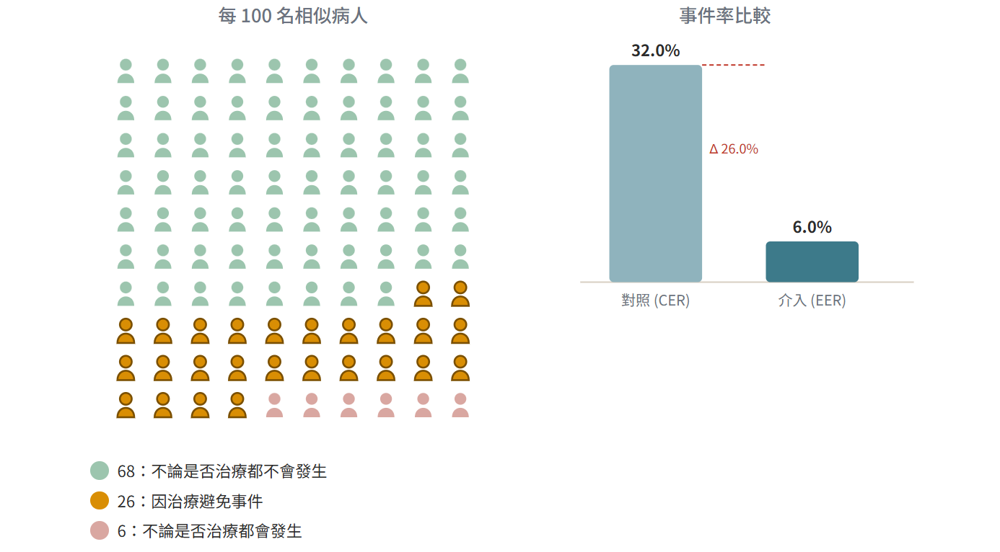

# 治療效益 EBM 計算器（tx-ebm-calc）

互動式治療效益實證計算器：輸入兩組結果，產生 **ARR / NNT / NNH / RRR / RR / OR**、可複製的**白話說明**，以及**百人效益圖（Cates plot）/ 長條圖**，並可列印單頁總表。為 [dx-ebm-calc](https://github.com/liangRXdev/dx-ebm-calc)（診斷端）的姊妹作。

> 教學／實證練習用，**非臨床決策依據**。

[](https://liangrxdev.github.io/tx-ebm-calc/)



## 功能

- **三種輸入模式**
  - 四宮格（人數）：介入／對照 × 事件／無事件
  - 百分比（風險）：EER / CER（可附樣本數以算 CI）
  - 人年（Patient-Years）：事件數 + 人年 + 時間框架，累積風險採 `1 − e^(−rate·t)`
- **方向自動判定**：依「不良事件（要減少）／有益事件（要增加）」產出 NNT（效益）或 NNH（危害）
- **白話核心指標**：ARR/ARI、NNT/NNH、RRR；RR/OR 收於進階區
- **可複製白話說明**：自動帶入介入／對照／結果／族群用詞
- **百人效益圖**：Cates plot（預設）／長條圖／併呈，圖一律唯讀（手機友善）
- **列印說明總表**：單頁排版，可另存 PDF
- **PWA**：可安裝、離線可用

## 統計方法

| 指標 | 95% CI 方法 | 來源 |
|---|---|---|
| ARR（風險差） | Newcombe-Wilson hybrid score | Newcombe, Stat Med 1998 |
| NNT | 由 ARR 的 CI 取倒數；跨 0 時表為「NNTB…∞…NNTH」 | Altman, BMJ 1998;317:1309 |
| RR | Katz log | |
| OR | Woolf log | |
| 比率（rate） | Wald（rate difference）/ log（rate ratio） | Poisson |

零格自動 +0.5 連續性校正（Haldane-Anscombe，作用於比值型指標）。

## 開發

- 純前端、單檔 `index.html` + `engine.js`（計算引擎，無 DOM 依賴）
- 引擎測試：`node engine.test.js`
- 圖示產生：`node tools/gen-icons.js`
- 本機預覽：`node .serve.js` 後開 <http://localhost:8732/>

## 結構

```
index.html              UI（載入 engine.js）
engine.js               計算引擎（瀏覽器 + Node 共用）
engine.test.js          引擎測試
manifest.webmanifest    PWA manifest
sw.js                   Service Worker（快取 shell）
icons/                  PWA 圖示
tools/gen-icons.js      圖示產生器
```
