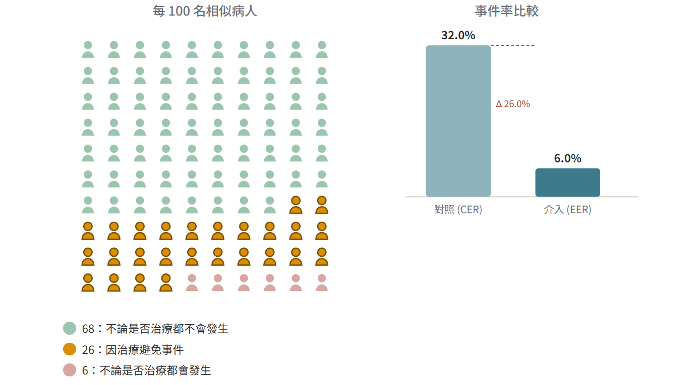

# Treatment-Effect EBM Calculator (tx-ebm-calc)

**English** | [繁體中文](README.zh-TW.md)

An interactive evidence-based calculator for treatment effects: enter results for two groups and get **ARR / NNT / NNH / RRR / RR / OR**, a copyable **plain-language explanation**, and a **100-person Cates plot / bar chart**, with a printable one-page summary. Sister project of [dx-ebm-calc](https://github.com/liangRXdev/dx-ebm-calc) (the diagnostic side).

> For teaching and EBM practice only — **not a basis for clinical decisions**. The interface is in Traditional Chinese.

[](https://liangrxdev.github.io/tx-ebm-calc/)



## Features

### Input
- **Three input modes**
  - 2×2 table (counts): intervention / control × event / no event
  - Percentages (risk): EER / CER (optionally with sample sizes for CIs)
  - Patient-years: events + patient-years + time frame; cumulative risk uses `1 − e^(−rate·t)`
- **Built-in teaching examples**: load illustrative scenarios in one click (secondary prevention, smoking-cessation intervention, stroke per patient-year)
- **Outcome direction toggle**: choose "adverse event (want fewer)" or "beneficial event (want more)" and the tool **automatically** reports NNT (benefit) or NNH (harm), with the wording and charts following suit

### Effect measures
- **Plain-language core**: ARR/ARI, NNT/NNH, RRR, CER, EER
- **Advanced measures (collapsible)**: RR, OR
- **NNT confidence interval**: Altman's method; when the interval crosses "no difference" it is shown as `NNTB … ∞ … NNTH` rather than a misleading single finite value
- **Automatic zero-cell correction**: when any cell is 0, ratio measures (RR/OR) get a +0.5 continuity correction, flagged on screen
- **Patient-years mode only**: cumulative-risk conversion, rate difference / rate ratio (per 1,000 patient-years) with CIs

### Individualization and cost (decision support)
- **Individualized extrapolation**: enter a patient's baseline risk (PEER); the trial RR is applied to recompute an **individualized NNT / ARR / expected EER** (Sackett/CEBM method, assumes constant RRR)
- **Cost to prevent one event**: enter per-patient intervention cost to get `NNT × cost`; the individualized scenario gets its own cost figure

### Plain-language explanation
- **One-click copy**: suitable for pasting into notes or teaching handouts
- Automatically fills in intervention / control / outcome / population wording, plus NNT CI, cost and individualized-extrapolation remarks

### Visualization (charts are read-only and mobile-friendly)
- **100-person Cates plot**: 100 similar patients split into "no event regardless of treatment / event avoided thanks to treatment / event regardless of treatment"
  - Icons switch between **dots / pictograms**
  - Layout switches between **clustered / randomly scattered** (stable for the same data)
- **Bar chart**: CER vs EER with the **Δ (ARR gap)** annotated
- **Side-by-side mode**: Cates plot and bar chart together
- **Colorblind-safe palette**: Okabe-Ito colors, with hatching as redundant "shape" encoding for key categories (not relying on color alone)

### Output and experience
- **Printable summary**: scenario, raw inputs, core measures, individualized extrapolation, plain-language conclusion, Cates plot and disclaimer on a **single-page report** — print or save as PDF
- **PWA**: installable, works offline
- **Mobile-friendly**: numeric keypad (`inputmode`), read-only charts to avoid accidental taps

## Statistical Methods

| Measure | 95% CI method | Source |
|---|---|---|
| ARR (risk difference) | Newcombe-Wilson hybrid score | Newcombe, Stat Med 1998 |
| NNT | Reciprocal of the ARR CI; shown as "NNTB…∞…NNTH" when crossing 0 | Altman, BMJ 1998;317:1309 |
| RR | Katz log | |
| OR | Woolf log | |
| Rate | Wald (rate difference) / log (rate ratio) | Poisson |

Zero cells get an automatic +0.5 continuity correction (Haldane-Anscombe, applied to ratio measures).

## Development

- Pure frontend: single `index.html` + `engine.js` (calculation engine, no DOM dependency)
- Engine tests: `node engine.test.js`
- Icon generation: `node tools/gen-icons.js`
- Local preview: run `node .serve.js` then open <http://localhost:8732/>

## Structure

```
index.html              UI (loads engine.js)
engine.js               Calculation engine (shared by browser + Node)
engine.test.js          Engine tests
manifest.webmanifest    PWA manifest
sw.js                   Service worker (caches the shell)
icons/                  PWA icons
tools/gen-icons.js      Icon generator
```
